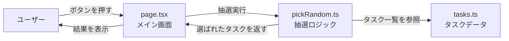

<div align="center">

# 🎰 隙間時間ルーレット

**隙間時間に「次にやること」を即決するシンプルな Web アプリ**

[](https://nextjs.org/)
[](https://react.dev/)
[](https://www.typescriptlang.org/)
[](https://tailwindcss.com/)
[](docker-compose.yml)
[](LICENSE)

🔗 **ライブデモ：[sukima-app.vercel.app](https://sukima-app.vercel.app/)**

</div>

---

## 📖 概要

「次に何をしよう？」という迷いをゼロにする、ルーレット式タスク選択アプリです。
ボタンひとつで今すぐやるべきことをランダムに決定し、隙間時間を有効活用できます。
タスクの内容は `src/data/tasks.ts` を編集するだけで自由にカスタマイズ可能です。

### なぜ作ったのか

- 休憩中や隙間時間に「何をしようか」と迷い、結局何もしないまま時間が過ぎてしまう経験があった
- 「次にやること」を即決する仕組みがあれば、隙間時間を無駄にせず有効活用できると考えた
- シンプルな UI でストレスなく使えるツールを自分で作ることにした

---

## 🖼 スクリーンショット

<div align="center">


</div>

---

## ✨ 機能

| 機能 | 説明 |
|------|------|
| ランダム抽選 | 登録タスクから等確率で1件を選択 |
| スピンアニメーション | 1.5秒のローディング演出 |
| 再抽選 | 「もう一度」ボタンで即リセット |
| タスクカスタマイズ | `tasks.ts` を編集するだけで追加・変更可能 |

---

## 🛠 技術スタック

| カテゴリ | 技術 | バージョン |
|----------|------|-----------|
| フレームワーク | Next.js (App Router) | 16 |
| UI ライブラリ | React | 19 |
| スタイリング | Tailwind CSS | 4 |
| 言語 | TypeScript | 5 |
| ランタイム | Node.js | 18+ |
| コンテナ | Docker | — |
| デプロイ | Vercel | — |

---

## 🏗 アーキテクチャ



---

## 🚀 セットアップ

起動方法は **Docker を使う方法** と **ローカルの Node.js を使う方法** の 2 通りあります。

---

### 方法 1：Docker で起動する（推奨）

Node.js のインストール不要。Docker さえあれば動きます。

#### 前提条件

- [Docker Desktop](https://www.docker.com/products/docker-desktop/) がインストール済みであること

#### 手順

```bash
# リポジトリをクローン
git clone https://github.com/ryusei2790/sukima-app.git
cd sukima-app

# コンテナをビルドして起動
docker compose up
```

ブラウザで [http://localhost:3000](http://localhost:3000) を開く。

> ファイルを編集すると、コンテナを再起動しなくてもブラウザに即時反映されます（ホットリロード）。

#### 停止

```bash
docker compose down
```

---

### 方法 2：ローカルの Node.js で起動する

#### 前提条件

- Node.js 18 以上

#### 手順

```bash
# リポジトリをクローン
git clone https://github.com/ryusei2790/sukima-app.git
cd sukima-app

# 依存パッケージをインストール
npm install

# 開発サーバーを起動
npm run dev
```

ブラウザで [http://localhost:3000](http://localhost:3000) を開く。

#### 本番ビルド

```bash
npm run build
npm start
```

---

## 📖 使い方

1. **「回す」ボタンを押す** — 抽選がスタートします
2. **約1.5秒待つ** — ルーレットのアニメーションが流れます
3. **タスクが表示される** — 今すぐやることが決定！
4. **「もう一度」を押す** — 別のタスクを選び直したい場合

---

## 🔧 タスクのカスタマイズ

[src/data/tasks.ts](src/data/tasks.ts) の配列を直接編集します。

```ts
export const tasks: Task[] = [
  { id: "read",     label: "本を読む" },
  { id: "breath",   label: "深呼吸する" },
  { id: "meditate", label: "瞑想する" },
  // ↓ ここに追加する
  { id: "walk",     label: "散歩する" },
  { id: "stretch",  label: "ストレッチする" },
];
```

- `id` — 一意な識別子（英数字推奨）
- `label` — 画面に表示するテキスト

---

## 📁 ファイル構成

```
sukima-app/
├── src/
│   ├── app/
│   │   ├── layout.tsx          # ルートレイアウト（Nav を含む）
│   │   ├── page.tsx            # メイン画面（状態管理・UI）
│   │   └── how-to-use/
│   │       └── page.tsx        # 使い方ページ
│   ├── components/
│   │   └── Nav.tsx             # ナビゲーションバー
│   ├── data/
│   │   └── tasks.ts            # タスク一覧（ここを編集）
│   └── lib/
│       └── pickRandom.ts       # 等確率抽選ロジック
├── Dockerfile
├── docker-compose.yml
├── public/                     # 静的アセット
├── package.json
└── README.md
```

---

## 📄 ライセンス

[MIT](LICENSE)
