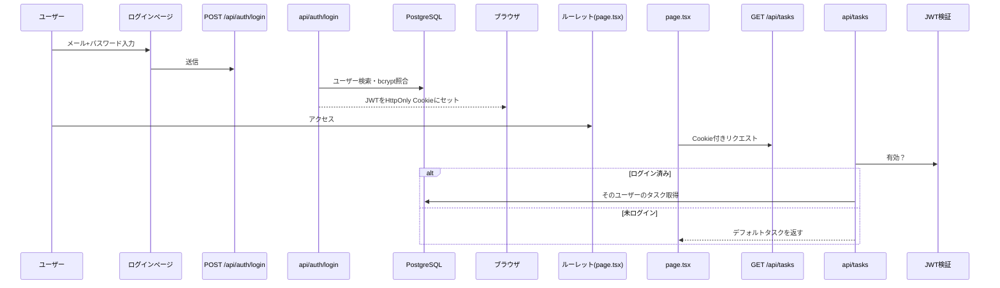

# アーキテクチャ設計書

## 概要

隙間時間ルーレット アプリに認証・ユーザー別タスク管理機能を追加する。

- 未ログイン：ハードコードのデフォルトタスクでルーレット
- ログイン済み：DBに保存したユーザー独自のタスクでルーレット

---

## 技術スタック

| カテゴリ | 技術 | 理由 |
|----------|------|------|
| フロントエンド | Next.js（App Router） | 既存構成を維持 |
| API | Next.js API Routes（route.ts） | 別サーバー不要 |
| 認証 | 自前JWT（jose） | シンプル・拡張不要 |
| パスワード | bcrypt | ハッシュ化による安全な保存 |
| ORM | Prisma | PostgreSQL との型安全な接続 |
| DB | PostgreSQL on Render | 外部ホスティング |

---

## ディレクトリ構成

```
src/
├── app/
│   ├── page.tsx                    # ルーレット（既存・修正）
│   ├── login/
│   │   └── page.tsx                # ログインページ（新規）
│   ├── set/
│   │   └── page.tsx                # タスク管理ページ（新規）
│   └── api/
│       ├── auth/
│       │   ├── login/route.ts      # POST /api/auth/login
│       │   └── logout/route.ts     # POST /api/auth/logout
│       └── tasks/
│           ├── route.ts            # GET /api/tasks, POST /api/tasks
│           └── [id]/route.ts       # DELETE /api/tasks/:id
├── data/
│   └── tasks.ts                    # デフォルトタスク（既存・維持）
├── lib/
│   ├── pickRandom.ts               # 既存
│   ├── db.ts                       # Prisma Client シングルトン
│   └── auth.ts                     # JWT発行・検証（jose）
└── prisma/
    └── schema.prisma               # DBスキーマ定義
```

---

## DBスキーマ

```prisma
model User {
  id        String   @id @default(cuid())
  email     String   @unique
  password  String   # bcryptハッシュ
  tasks     Task[]
  createdAt DateTime @default(now())
}

model Task {
  id        String   @id @default(cuid())
  label     String
  userId    String
  user      User     @relation(fields: [userId], references: [id])
  createdAt DateTime @default(now())
}
```

---

## APIエンドポイント一覧

| メソッド | パス | 認証 | 説明 |
|----------|------|------|------|
| POST | /api/auth/login | 不要 | ログイン（JWTをCookieにセット） |
| POST | /api/auth/logout | 不要 | ログアウト（Cookie削除） |
| GET | /api/tasks | 任意 | タスク取得（未認証はデフォルト返却） |
| POST | /api/tasks | 必須 | タスク追加 |
| DELETE | /api/tasks/:id | 必須 | タスク削除 |

---

## 認証フロー



---

## セキュリティ設計

| 項目 | 対応 |
|------|------|
| パスワード保存 | bcryptでハッシュ化（平文保存なし） |
| JWT保存場所 | HttpOnly Cookie（JSからアクセス不可） |
| Cookie設定 | SameSite=Strict（CSRF対策） |
| CSRF対策 | SameSite=Strict で簡易対応（トークンは省略） |

---

## 懸念点・注意事項

- Render PostgreSQL 無料プランは **90日で停止**。本番運用には定期アクセスか有料プランが必要
- 新規登録はAPIを直接叩く形（管理者のみが登録できる想定）か、別途サインアップページが必要
